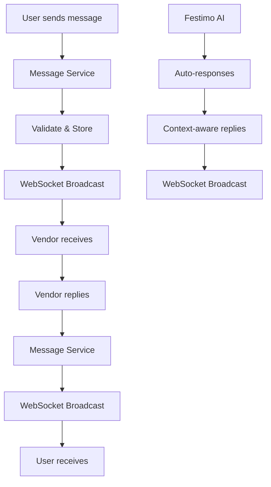

# 🎊 Communication System Architecture
## Festipin Vendor Communication Platform

---

## 📋 **System Overview**

The Communication System is a **separate project** under festipin that provides real-time vendor communication capabilities. It integrates seamlessly with the existing festipin architecture while maintaining modularity and scalability.

### **🎯 Core Objectives**
- **Real-time vendor communication** with Festimo and chosen vendors
- **Unified communication hub** for all party planning conversations
- **Seamless integration** with existing party planning workflow
- **Advanced UI/UX** with magical, responsive design
- **Scalable architecture** supporting multiple vendors and conversations

---

## 🏗️ **Architecture Design**

### **📁 Project Structure**
```
festipin/
├── backend/
│   ├── app/
│   │   ├── communication/          # 🆕 Communication System
│   │   │   ├── __init__.py
│   │   │   ├── models/             # Communication data models
│   │   │   │   ├── __init__.py
│   │   │   │   ├── message.py      # Message, Conversation models
│   │   │   │   ├── vendor.py       # Vendor, VendorProfile models
│   │   │   │   └── notification.py # Notification models
│   │   │   ├── services/           # Business logic
│   │   │   │   ├── __init__.py
│   │   │   │   ├── message_service.py    # Message handling
│   │   │   │   ├── vendor_service.py     # Vendor management
│   │   │   │   ├── notification_service.py # Push notifications
│   │   │   │   └── websocket_service.py  # Real-time communication
│   │   │   ├── api/                # API endpoints
│   │   │   │   ├── __init__.py
│   │   │   │   ├── routes/
│   │   │   │   │   ├── __init__.py
│   │   │   │   │   ├── messages.py       # Message CRUD
│   │   │   │   │   ├── conversations.py  # Conversation management
│   │   │   │   │   ├── vendors.py        # Vendor endpoints
│   │   │   │   │   └── websocket.py      # WebSocket routes
│   │   │   │   └── dependencies.py       # Auth, validation
│   │   │   └── middleware/          # Communication-specific middleware
│   │   │       ├── __init__.py
│   │   │       ├── rate_limiting.py      # Message rate limiting
│   │   │       └── vendor_auth.py         # Vendor authentication
│   │   └── ... (existing festipin backend)
├── frontend/
│   ├── src/
│   │   ├── communication/           # 🆕 Communication System Frontend
│   │   │   ├── components/         # React components
│   │   │   │   ├── CommunicationHub.tsx      # Main communication interface
│   │   │   │   ├── ConversationList.tsx      # List of conversations
│   │   │   │   ├── ConversationView.tsx      # Individual conversation
│   │   │   │   ├── MessageBubble.tsx         # Individual message
│   │   │   │   ├── VendorSelector.tsx         # Vendor selection
│   │   │   │   ├── MessageComposer.tsx       # Message input
│   │   │   │   ├── TypingIndicator.tsx       # Real-time typing
│   │   │   │   ├── NotificationCenter.tsx     # Notifications
│   │   │   │   └── VendorProfile.tsx         # Vendor information
│   │   │   ├── hooks/              # Custom React hooks
│   │   │   │   ├── useCommunication.ts       # Main communication hook
│   │   │   │   ├── useWebSocket.ts           # WebSocket management
│   │   │   │   ├── useMessages.ts            # Message state management
│   │   │   │   ├── useVendors.ts             # Vendor data management
│   │   │   │   └── useNotifications.ts       # Notification handling
│   │   │   ├── services/           # API services
│   │   │   │   ├── communicationApi.ts       # Communication API calls
│   │   │   │   ├── websocketService.ts      # WebSocket service
│   │   │   │   └── notificationService.ts   # Push notifications
│   │   │   ├── types/              # TypeScript types
│   │   │   │   ├── communication.ts          # Communication types
│   │   │   │   ├── vendor.ts                 # Vendor types
│   │   │   │   └── websocket.ts             # WebSocket types
│   │   │   └── utils/              # Utilities
│   │   │       ├── messageUtils.ts          # Message formatting
│   │   │       ├── dateUtils.ts             # Date/time utilities
│   │   │       └── validation.ts            # Input validation
│   │   └── ... (existing festipin frontend)
└── ... (existing festipin structure)
```

---

## 🔌 **Integration Points**

### **🔄 Existing System Integration**

#### **1. Party Planning Workflow Integration**
```typescript
// Frontend: Party Summary → Communication Hub
PartySummary.tsx
├── onNext() → Navigate to CommunicationHub
├── Pass partyId, vendorRecommendations
└── Maintain party context
```

#### **2. Backend Event System Integration**
```python
# Backend: Event-driven communication triggers
Event Bus Integration:
├── party.plan.completed → Initialize vendor conversations
├── vendor.selected → Create conversation channel
├── message.sent → Real-time WebSocket broadcast
└── vendor.replied → Notification system
```

#### **3. WebSocket Architecture Extension**
```python
# Extend existing WebSocket system
Existing: /ws/orchestration/{event_id}
New:     /ws/communication/{party_id}
         /ws/vendor/{vendor_id}
         /ws/notifications/{user_id}
```

---

## 📊 **Data Models**

### **🗨️ Communication Models**

#### **Message Model**
```python
class Message(BaseModel):
    message_id: str = Field(default_factory=lambda: f"msg_{uuid.uuid4().hex[:12]}")
    conversation_id: str
    sender_id: str  # user_id or vendor_id
    sender_type: Literal["user", "vendor", "festimo"]
    content: str
    message_type: Literal["text", "image", "file", "quote", "system"]
    attachments: List[Attachment] = Field(default_factory=list)
    reply_to: Optional[str] = None  # message_id being replied to
    status: Literal["sent", "delivered", "read"] = "sent"
    timestamp: str = Field(default_factory=lambda: datetime.utcnow().isoformat())
    metadata: Dict[str, Any] = Field(default_factory=dict)
```

#### **Conversation Model**
```python
class Conversation(BaseModel):
    conversation_id: str = Field(default_factory=lambda: f"conv_{uuid.uuid4().hex[:12]}")
    party_id: str  # Links to existing party
    vendor_id: Optional[str] = None
    vendor_type: Optional[str] = None  # "balloon_artist", "caterer", etc.
    participants: List[str]  # [user_id, vendor_id, "festimo"]
    status: Literal["active", "archived", "closed"] = "active"
    last_message: Optional[Message] = None
    unread_count: Dict[str, int] = Field(default_factory=dict)  # per participant
    created_at: str = Field(default_factory=lambda: datetime.utcnow().isoformat())
    updated_at: str = Field(default_factory=lambda: datetime.utcnow().isoformat())
    metadata: Dict[str, Any] = Field(default_factory=dict)
```

#### **Vendor Profile Model**
```python
class VendorProfile(BaseModel):
    vendor_id: str
    vendor_type: str  # "balloon_artist", "caterer", "photographer"
    business_name: str
    contact_name: str
    email: str
    phone: Optional[str] = None
    avatar_url: Optional[str] = None
    rating: float = Field(ge=0, le=5)
    response_time_avg: int  # minutes
    availability_status: Literal["online", "away", "offline"] = "offline"
    specialties: List[str] = Field(default_factory=list)
    portfolio: List[str] = Field(default_factory=list)  # image URLs
    pricing_info: Dict[str, Any] = Field(default_factory=dict)
    created_at: str = Field(default_factory=lambda: datetime.utcnow().isoformat())
```

---

## 🔄 **Real-Time Communication Flow**

### **📡 WebSocket Architecture**

#### **1. Communication WebSocket**
```typescript
// Frontend WebSocket Connection
const communicationWs = new WebSocket(`ws://localhost:9000/ws/communication/${partyId}`)

// Message Types
interface CommunicationMessage {
  type: 'message_sent' | 'message_received' | 'typing_start' | 'typing_stop' | 'vendor_online' | 'vendor_offline'
  conversation_id: string
  message?: Message
  sender_id?: string
  timestamp: string
}
```

#### **2. Vendor WebSocket**
```typescript
// Vendor-specific WebSocket for real-time updates
const vendorWs = new WebSocket(`ws://localhost:9000/ws/vendor/${vendorId}`)

// Vendor Status Updates
interface VendorStatusUpdate {
  type: 'status_change' | 'availability_update' | 'response_time_update'
  vendor_id: string
  status: 'online' | 'away' | 'offline'
  response_time_avg?: number
  timestamp: string
}
```

### **🔄 Message Flow**



---

## 🎨 **Frontend Architecture**

### **🧩 Component Hierarchy**

```
CommunicationHub (Main Container)
├── ConversationList (Sidebar)
│   ├── ConversationItem
│   └── VendorSelector
├── ConversationView (Main Area)
│   ├── MessageList
│   │   └── MessageBubble
│   ├── TypingIndicator
│   └── MessageComposer
└── NotificationCenter (Overlay)
    ├── NotificationItem
    └── NotificationSettings
```

### **🎯 Key Components**

#### **1. CommunicationHub**
```typescript
interface CommunicationHubProps {
  partyId: string
  vendorRecommendations: VendorRecommendation[]
  onBack: () => void
}

// Features:
- Real-time message updates
- Vendor status monitoring
- Conversation management
- Notification handling
- Responsive design
```

#### **2. MessageBubble**
```typescript
interface MessageBubbleProps {
  message: Message
  isOwn: boolean
  showAvatar: boolean
  showTimestamp: boolean
}

// Features:
- Message formatting
- Attachment display
- Reply threading
- Status indicators
- Animation effects
```

#### **3. VendorSelector**
```typescript
interface VendorSelectorProps {
  vendors: VendorProfile[]
  selectedVendor: string | null
  onSelect: (vendorId: string) => void
}

// Features:
- Vendor search/filter
- Online status indicators
- Rating display
- Quick contact options
```

---

## 🔧 **Backend Services**

### **📨 Message Service**
```python
class MessageService:
    async def send_message(self, conversation_id: str, sender_id: str, content: str) -> Message
    async def get_conversation_messages(self, conversation_id: str, limit: int = 50) -> List[Message]
    async def mark_messages_read(self, conversation_id: str, user_id: str) -> None
    async def delete_message(self, message_id: str) -> bool
    async def search_messages(self, query: str, conversation_id: str) -> List[Message]
```

### **👥 Vendor Service**
```python
class VendorService:
    async def get_vendor_profile(self, vendor_id: str) -> VendorProfile
    async def update_vendor_status(self, vendor_id: str, status: str) -> None
    async def get_available_vendors(self, party_id: str) -> List[VendorProfile]
    async def create_vendor_conversation(self, party_id: str, vendor_id: str) -> Conversation
    async def rate_vendor(self, vendor_id: str, rating: float, review: str) -> None
```

### **🔔 Notification Service**
```python
class NotificationService:
    async def send_notification(self, user_id: str, notification: Notification) -> None
    async def create_message_notification(self, message: Message) -> None
    async def create_vendor_response_notification(self, vendor_id: str, message: Message) -> None
    async def get_user_notifications(self, user_id: str) -> List[Notification]
    async def mark_notification_read(self, notification_id: str) -> None
```

---

## 🚀 **API Endpoints**

### **📨 Message Endpoints**
```python
# Message Management
POST   /api/v1/communication/conversations/{conversation_id}/messages
GET    /api/v1/communication/conversations/{conversation_id}/messages
PUT    /api/v1/communication/messages/{message_id}
DELETE /api/v1/communication/messages/{message_id}

# Message Search
GET    /api/v1/communication/conversations/{conversation_id}/search?q={query}
```

### **💬 Conversation Endpoints**
```python
# Conversation Management
GET    /api/v1/communication/parties/{party_id}/conversations
POST   /api/v1/communication/conversations
GET    /api/v1/communication/conversations/{conversation_id}
PUT    /api/v1/communication/conversations/{conversation_id}
DELETE /api/v1/communication/conversations/{conversation_id}

# Conversation Status
PUT    /api/v1/communication/conversations/{conversation_id}/read
PUT    /api/v1/communication/conversations/{conversation_id}/archive
```

### **👥 Vendor Endpoints**
```python
# Vendor Management
GET    /api/v1/communication/vendors
GET    /api/v1/communication/vendors/{vendor_id}
PUT    /api/v1/communication/vendors/{vendor_id}/status
POST   /api/v1/communication/vendors/{vendor_id}/rate

# Vendor Conversations
POST   /api/v1/communication/parties/{party_id}/vendors/{vendor_id}/conversation
```

### **🔔 Notification Endpoints**
```python
# Notification Management
GET    /api/v1/communication/notifications
PUT    /api/v1/communication/notifications/{notification_id}/read
DELETE /api/v1/communication/notifications/{notification_id}
PUT    /api/v1/communication/notifications/settings
```

### **🌐 WebSocket Endpoints**
```python
# Real-time Communication
WS     /ws/communication/{party_id}
WS     /ws/vendor/{vendor_id}
WS     /ws/notifications/{user_id}
```

---

## 🎨 **UI/UX Design Principles**

### **✨ Magical Design System**
- **Glassmorphism**: Translucent cards with backdrop blur
- **Gradient Backgrounds**: Dynamic, animated gradients
- **Floating Elements**: Messages appear with smooth animations
- **Sparkle Effects**: Magical particles and shimmer effects
- **Responsive Design**: Mobile-first, adaptive layouts

### **🎪 Communication Features**
- **Real-time Typing Indicators**: Show when vendors are typing
- **Message Status**: Sent, delivered, read indicators
- **Rich Media Support**: Images, files, quotes
- **Message Threading**: Reply to specific messages
- **Search Functionality**: Find messages across conversations
- **Notification Center**: Centralized notification management

### **📱 Responsive Breakpoints**
```css
/* Mobile First */
.communication-hub {
  @apply flex flex-col h-screen;
}

/* Tablet */
@media (min-width: 768px) {
  .communication-hub {
    @apply flex-row;
  }
}

/* Desktop */
@media (min-width: 1024px) {
  .communication-hub {
    @apply max-w-7xl mx-auto;
  }
}
```

---

## 🔐 **Security & Authentication**

### **🛡️ Security Measures**
- **Rate Limiting**: Prevent message spam
- **Input Validation**: Sanitize all user inputs
- **Vendor Authentication**: Secure vendor access
- **Message Encryption**: End-to-end encryption for sensitive data
- **CORS Configuration**: Proper cross-origin setup

### **🔑 Authentication Flow**
```python
# Vendor Authentication
class VendorAuthMiddleware:
    async def authenticate_vendor(self, vendor_id: str, token: str) -> bool
    async def get_vendor_permissions(self, vendor_id: str) -> List[str]
    async def validate_vendor_access(self, vendor_id: str, conversation_id: str) -> bool
```

---

## 📈 **Performance & Scalability**

### **⚡ Performance Optimizations**
- **Message Pagination**: Load messages in chunks
- **WebSocket Connection Pooling**: Efficient connection management
- **Caching Strategy**: Redis for frequently accessed data
- **Database Indexing**: Optimized queries for messages and conversations
- **CDN Integration**: Fast media delivery

### **📊 Monitoring & Analytics**
- **Message Delivery Metrics**: Track delivery success rates
- **Response Time Analytics**: Monitor vendor response times
- **User Engagement**: Track conversation activity
- **Error Monitoring**: Real-time error tracking
- **Performance Metrics**: WebSocket connection health

---

## 🧪 **Testing Strategy**

### **🔬 Testing Approach**
- **Unit Tests**: Individual service and component testing
- **Integration Tests**: API endpoint testing
- **WebSocket Tests**: Real-time communication testing
- **E2E Tests**: Complete user journey testing
- **Performance Tests**: Load testing for WebSocket connections

### **📋 Test Coverage**
```python
# Backend Test Structure
tests/
├── communication/
│   ├── test_message_service.py
│   ├── test_vendor_service.py
│   ├── test_websocket_service.py
│   └── test_api_endpoints.py
```

---

## 🚀 **Deployment Strategy**

### **🐳 Containerization**
```dockerfile
# Communication Service Dockerfile
FROM python:3.11-slim
WORKDIR /app
COPY requirements.txt .
RUN pip install -r requirements.txt
COPY . .
CMD ["uvicorn", "app.communication.main:app", "--host", "0.0.0.0", "--port", "8000"]
```

### **☁️ Infrastructure**
- **Microservice Architecture**: Separate communication service
- **Load Balancing**: Handle multiple WebSocket connections
- **Database Scaling**: Separate communication database
- **Redis Cluster**: Message queuing and caching
- **CDN**: Media file delivery

---

## 📋 **Implementation Phases**

### **🎯 Phase 1: Core Communication (Week 1-2)**
- [ ] Backend message models and services
- [ ] Basic WebSocket implementation
- [ ] Frontend CommunicationHub component
- [ ] Message sending/receiving
- [ ] Basic vendor integration

### **🎯 Phase 2: Advanced Features (Week 3-4)**
- [ ] Real-time typing indicators
- [ ] Message status tracking
- [ ] Notification system
- [ ] Vendor profile management
- [ ] Search functionality

### **🎯 Phase 3: UI/UX Polish (Week 5-6)**
- [ ] Magical design implementation
- [ ] Animation and transitions
- [ ] Responsive design optimization
- [ ] Performance optimization
- [ ] Error handling and edge cases

### **🎯 Phase 4: Integration & Testing (Week 7-8)**
- [ ] Full festipin integration
- [ ] End-to-end testing
- [ ] Performance testing
- [ ] Security audit
- [ ] Production deployment

---

## 🔗 **Integration Checklist**

### **✅ Existing System Integration**
- [ ] **Party Summary Integration**: Seamless transition from party planning
- [ ] **Vendor Recommendations**: Use existing vendor data from agents
- [ ] **WebSocket Architecture**: Extend existing WebSocket system
- [ ] **Event Bus Integration**: Connect to existing event-driven system
- [ ] **Authentication**: Use existing user authentication
- [ ] **Database**: Integrate with existing party data models

### **✅ Frontend Integration**
- [ ] **Navigation Flow**: Party Summary → Communication Hub
- [ ] **State Management**: Share party context between components
- [ ] **Design System**: Consistent with existing magical theme
- [ ] **Responsive Design**: Mobile and desktop compatibility
- [ ] **Error Handling**: Consistent error boundaries

---

## 🎊 **Success Metrics**

### **📊 Key Performance Indicators**
- **Message Delivery Rate**: >99% successful delivery
- **Response Time**: <2 seconds for message delivery
- **Vendor Response Time**: <30 minutes average
- **User Engagement**: >80% conversation completion rate
- **System Uptime**: >99.9% availability

### **🎯 User Experience Goals**
- **Intuitive Interface**: Easy vendor selection and messaging
- **Real-time Feel**: Instant message delivery and status updates
- **Magical Experience**: Delightful animations and interactions
- **Mobile Optimized**: Seamless experience on all devices
- **Accessibility**: WCAG 2.1 AA compliance

---

## 🎉 **Conclusion**

This Communication System architecture provides a **comprehensive, scalable, and magical** vendor communication platform that integrates seamlessly with the existing festipin system. The modular design ensures easy maintenance and future enhancements while delivering an exceptional user experience.

**Key Benefits:**
- ✨ **Magical UI/UX** with glassmorphism and animations
- 🔄 **Real-time Communication** via WebSocket architecture
- 🏗️ **Modular Design** for easy integration and maintenance
- 📱 **Responsive Design** for all devices
- 🔐 **Secure & Scalable** architecture
- 🎯 **User-Centric** design focused on vendor communication

The system is ready for implementation and will transform the party planning experience into a truly magical and efficient vendor communication platform! 🎊✨
